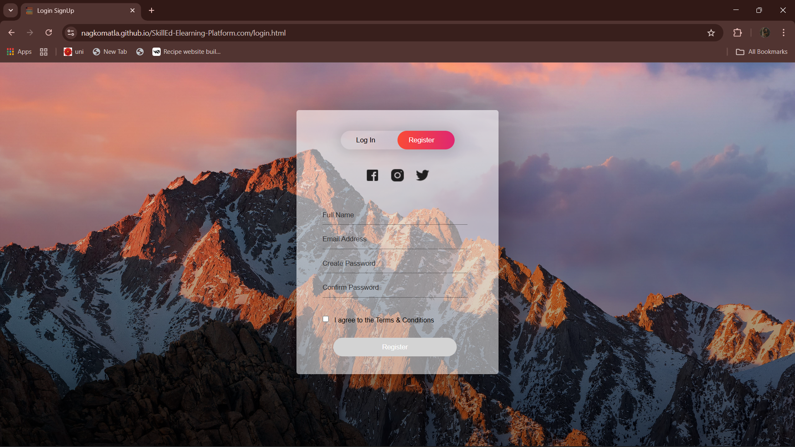
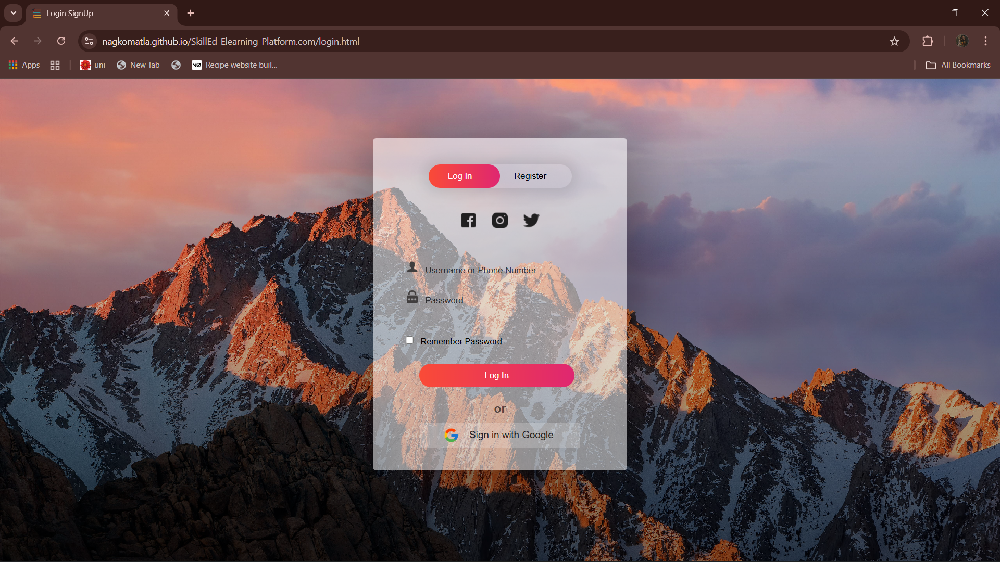
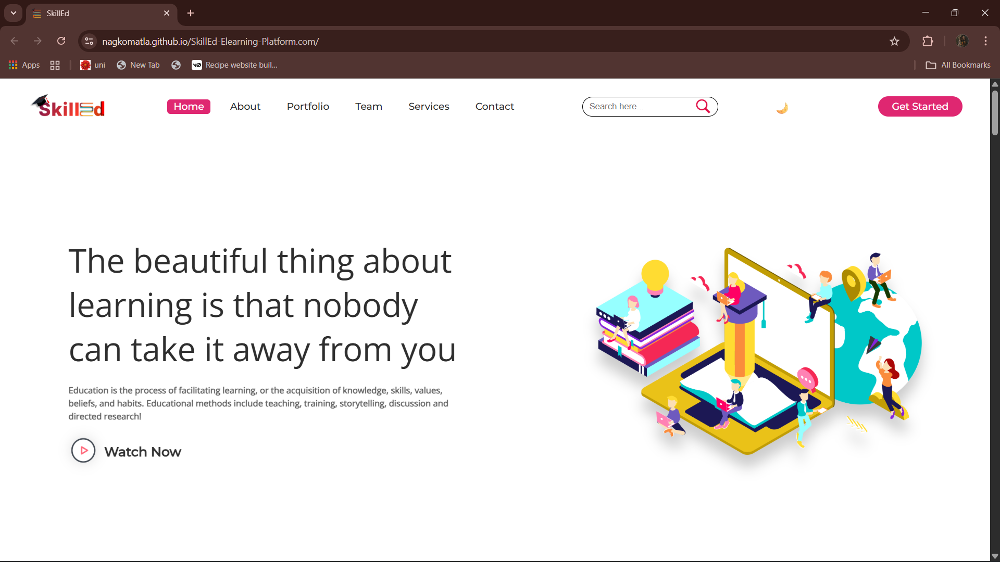
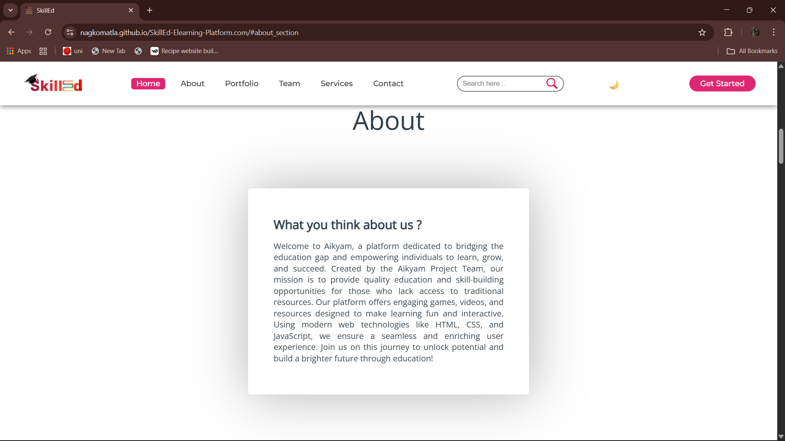
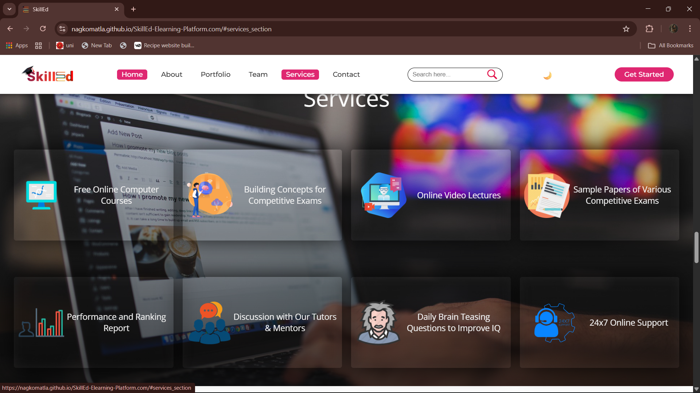
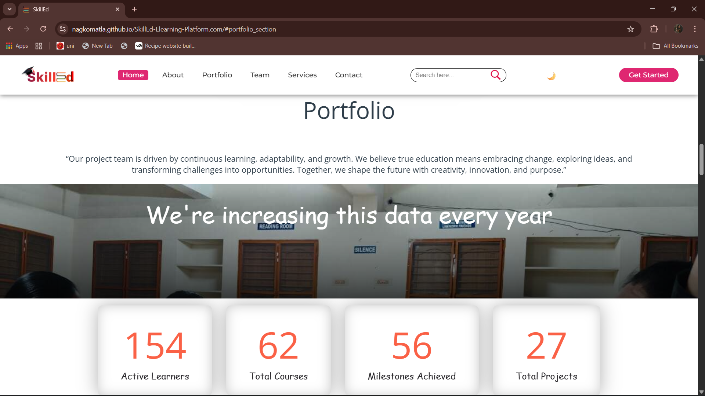
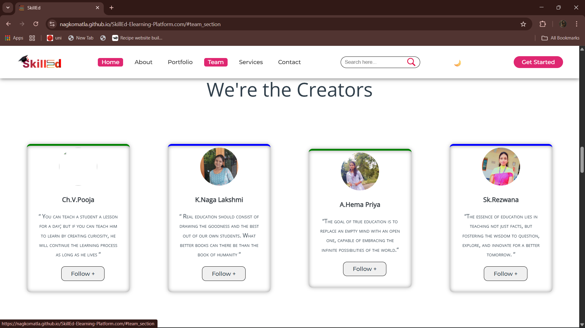
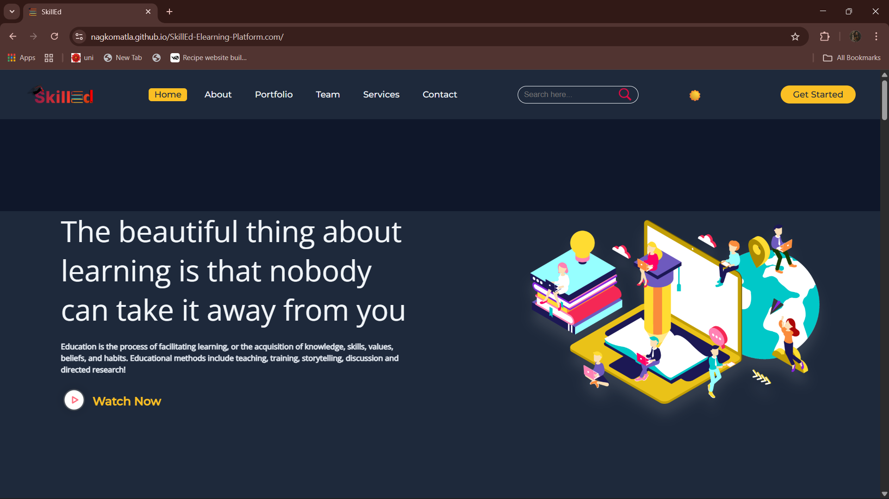

# 🎓 SkillEd – E-Learning Portal

An educational website for students and programmers 😊😊😊, built to provide **all education-related resources in one place**.

> 🚀 SkillEd - Empowering Learning, Simplifying Education

---

## 📑 Table of Contents
- [Features](#-features)
- [Project Structure](#-project-structure)
- [How to Use](#-how-to-use)
- [Screenshots](#-screenshots)
- [Future Overview](#-future-overview)
- [Roadmap](#-roadmap-planned-features)
- [FAQ](#-faq)
- [How to Contribute](#-how-to-contribute)
- [Contribution Guidelines](#-contribution-guidelines)
- [License](#-license)

---

## ✨ Features

* 📚 **Notes and Sample Papers** – Comprehensive resources for effective preparation.
* 🎥 **Online Video Lectures and Courses** – High-quality content for JEE-Main, JEE-Advanced, GATE, and more.
* ❓ **Doubt Clearance** – Students can submit questions directly for expert solutions.
* 🧠 **Quizzes** – Fun and interactive to test knowledge instantly.
* 💼 **Interview Preparation** – Placement-focused Q&A for career success.
* 🛠 **Projects Section** – Ideas and resources for Class 12 Board and final-year projects.
* 📱 **Fully Responsive** – Smooth experience across desktop, tablet, and mobile.

---

## 📁 Project Structure

```
SKILLED-Elearning-Platform.com/
│
├── assets/
│   ├── .gitkeep
│   ├── docs/
│   │   └── README.md
│   ├── images/
│   │   ├── courses/
│   │   ├── creator/
│   │   ├── extra/
│   │   ├── icon/
│   │   └── projects/
│
├── samplePapers/
│   ├── p1/
│   │   ├── p1.pdf
│   │   ├── p2.pdf
│   │   └── p3.pdf
│   └── README.md
│
├── src/
│   ├── subjects/
│   │   ├── GATE/
│   │   ├── computer_courses.html
│   │   ├── gate.html
│   │   ├── jee.html
│   │   ├── quiz.html
│   │   ├── quizStyle.css
│   │   └── subjects.css
│   ├── about.png
│   ├── animated.gif
│   ├── index.html
│   ├── login.html
│   ├── loginStyle.css
│   ├── script.js
│   ├── style.css
│   └── various image assets (PNG, JPG, SVG)
│
├── CONTRIBUTING.md
├── LICENSE
└── README.md
```


---

## 💡 How to Use

```
Clone this repo:
git clone https://github.com/Nagkomatla/SkillEd-Elearning-Platform.git

Open index.html in your browser (right click → Open with Live Server).

Explore notes, quizzes, videos, projects, and interview resources directly.

```
---

## 📷 Screenshots


1. **Register Page**  
     

2. **Login Page**  
     

3. **Home / Intro Page**  
     

4. **About Page**  
     

5. **Services Page**  
     

6. **Portfolio Page**  
     

7. **Team Page**  
     

8. **Contact Page**  
     

9. **Dark Mode View**  
     
---

## 🔮 Future Overview

SkillEd aims to become a **one-stop learning platform** with:
- Personalized learning dashboard
- AI-driven doubt resolution
- Gamified learning progress tracking
- Live online classes with integrated chat
- Multi-language support

---

## 🛠️ Roadmap (Planned Features)

* Add user authentication and profiles
* Store quiz scores and progress
* Enable PDF uploads and downloads for notes
* Video streaming optimization
* Mobile app version of SkillEd
* Discussion forums for peer-to-peer learning

---

## ❓ FAQ

**Q1:** Is SkillEd free to use?  
**A1:** Yes, all resources are currently free.

**Q2:** Can I access SkillEd on mobile?  
**A2:** Yes! The website is fully responsive.

**Q3:** Do I need to create an account?  
**A3:** No account is required for basic features; advanced features may require login in the future.

**Q4:** How can I contribute notes or projects?  
**A4:** You can fork the repository, add your resources, and submit a pull request.

---

## 🧑‍💻 How to Contribute

We welcome contributors of all skill levels!  

## How To Contribute

1. **Fork** the repository.  
2. **Clone** your fork:  
```
   git clone https://github.com/your-username/SkillEd-Elearning-Platform.git

Create a new branch:
git checkout -b your-feature-name
Make your changes and commit:
git commit -m "Added feature XYZ"
Push the branch and create a Pull Request.

```
---

## 🔖 Contribution Guidelines

Keep code clean and readable
Small, well-documented pull requests are preferred
Follow minimal UI design principles
Link issues you’re addressing in your PR
---

## 📜 License
This project is licensed under the MIT License – see the LICENSE.txt file for details.

---

## 🧑‍💻 Project Admin
Naga Laxmi
GitHub: [GitHub](https://github.com/Nagkomatla)
---

## 🙌 Support & Star
If you like this project, give it a ⭐ to support more such educational initiatives!